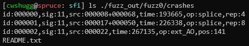
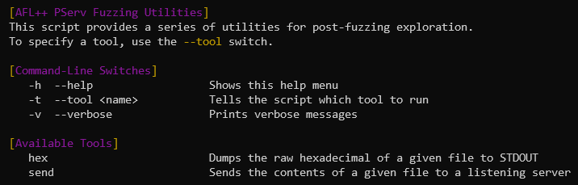
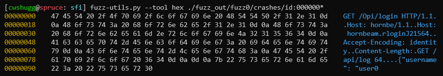
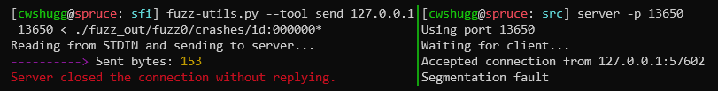

# What do I do after fuzzing? (`fuzz-utils.py`)

Once you've completed a fuzzing run, you'll most likely have a few output files whose contents caused your server to crash or hang. (If the fuzzer didn't report any, congratulations! Your server must be pretty robust.) Each of these files contains the exact input that was sent to your server that caused the issue. For example, from the example shown in `how_to_fuzz.md`, we can see a few of the crash files in `./fuzz_out/fuzz0/crashes`:


  
We can open one of these files up. Running `cat ./fuzz_out/fuzz0/crashes/id:000000,sig:11,src:000008+000068,time:193665,op:splice,rep:4` shows us the exact message that caused the server to crash:

```
GET /Opi/login HTTP/1.1
Host: hornbe/1.1
Host: hornbeam.rloginJ21564
Accept-Encoding: identity
Content-Length:
GET /api/log 64

{"username": "user0
```
  
Based on the name of the file (we can see `sig:11`), your server received a SIGSEGV signal (a segmentation fault). Using `fuzz-utils.py`, we can take a closer look at the file's contents and use it to recreate the same crash.

## Post-Fuzzing Utilities

Running `fuzz-utils.py` will produce a help menu, with a few tools you can use in tandem with these crash files:



With the `--tool` switch, you can specify a tool to invoke. They're discussed below.

## Hexdump Tool

To get a better idea of what's inside each crash/hang-inducing output file, a hexdump tool is built into `fuzz-utils.py`. The contents of a file are printed, in hexadecimal, when the script is invoked like so: `fuzz-utils.py --tool hex <path_to_file>`.
  
For example, if we take the crash file shown above and run it through the hexdump tool, we get:  



## Sending Tool

To actually reproduce a crash/hang found by AFL++, you'll want to send the exact same input to your server. To do this, launch your server in one terminal, and run this in another: `fuzz-utils.py --tool send <server_address> <server_port>`. The script will read STDIN and send it through a socket to your server. To send the contents of a file, simply use I/O redirection: `fuzz-utils.py --tool send <server_address> <server_port> < <path_to_file>`.
  
If we consider the same example as before, we can start our server (something like: `./server -p 13650`), then, on the same machine, run `fuzz-utils.py --tool send 127.0.0.1 13650 < ./fuzz_out/fuzz0/crashes/id:000000,sig:11,src:000008+000068,time:193665,op:splice,rep:4`. When the server tries to parse the input, the segmentation fault will occur.


  
With this, you'll be able to debug: launch your server in GCC in one terminal, send the crash file's contents in another, and go to town.
