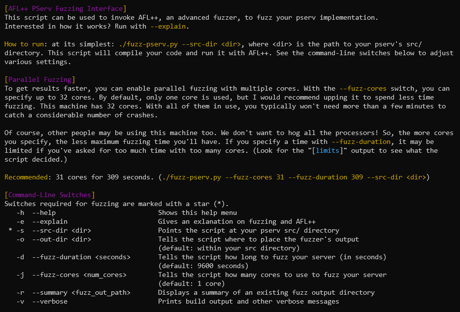
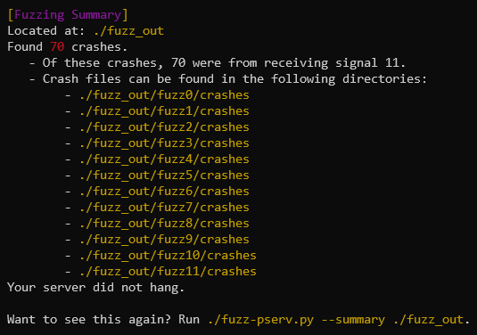

# How do I fuzz my server? (`fuzz-pserv.py`)

Fuzzing your server can be done using the `fuzz-pserv.py` python script, located in the CS 3214 bin folder on RLogin (`/home/courses/cs3214/bin/fuzz-pserv.py`). To get started, simply run `fuzz-pserv.py` - you'll be presented with a help menu:

  
Fuzzing your server is as simple as typing `fuzz-pserv.py --src-dir <your_src_dir>`. The script will compile your code with AFL++'s compiler, perform a small test run, then launch AFL++. You'll be presented with the AFL++ status screen. You can choose to either wait until the fuzzer times out (this time varies - see below), or you can use Ctrl-C to terminate it.
  
To understand everything displayed on the status screen, check out [AFL++'s documentation](https://aflplus.plus/docs/status_screen/). You'll probably be most interested in the "overall results" section of the status screen, displayed in the top-right corner. This gives a report of all unique crashes and hangs, as well as how many "paths" the fuzzer has discovered. (A "path" describes a unique path of code executed by your server. A "unique" crash/hang describes a crash/hang that was found on one such path.)

## Parallel Fuzzing

By default, this script invokes AFL++ using a single core on the system. However, you can specify any number of cores (up to the maximum) to spawn _multiple_ AFL++ processes (one on each core). These processes work together to find crashes/hangs - as a whole, they can typically find more bugs faster than a single process on a single core.
  
You can use the `--fuzz-cores` switch to specify the number of cores you wish to use.

### Timing/Core Limits

As you might know, RLogin can get pretty cluttered as we move closer to project deadlines. Parallel fuzzing is very effective, but using too many cores on a machine can prevent others from getting work done. Because of this, limits are established to prevent any one student from fuzzing with too many cores for too long.
  
This limit is described in "CPU-Seconds" - a maximum number of time you can fuzz that varies with the number of cores you use. The more cores you specify with `--fuzz-cores`, the less maximum time you'll be allowed to run AFL++. Using a single core (the default), you can run AFL++ for the longest time. Using two cores, you can run AFL++ for half that time. With three cores, you can run for a third of that time. (And so on.)

### Fuzzing Results

Once AFL++ has terminated (either by timeout or by Ctrl-C), the script will print a summary of the crashes/hangs that were found. By default, the output directory will be placed in your pserv's src directory (specified by `--src-dir`). However, you can use the `--out-dir` switch to specify otherwise.

  
If crashes or hangs are found, the directories containing the crash-inducing input files are listed in the summary. Time to investigate those bugs!